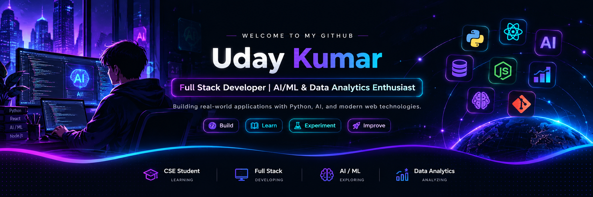

  

# 👋 Hi, I'm Uday Kumar

### Full Stack Developer | AI/ML & Data Analytics Enthusiast

Building real-world applications with Python, AI, and modern web technologies.

---

## 👨‍💻 About Me

- 🎓 Computer Science Engineering student
- 💻 Interested in full-stack web development
- 🤖 Learning Machine Learning, LLMs, and AI applications
- 📊 Exploring data analysis and visualization
- 🔐 Interested in cybersecurity and intelligent applications
- 🚀 Focused on building practical, real-world projects

---

## 🛠️ Tech Stack

### 🐍 Programming Languages

### 🤖 AI & Machine Learning

### 🧠 NLP, LLM & Generative AI

### 🌐 Full Stack Development

### 🗄️ Databases & Tools

### 📊 Data Analytics

---

## 🚀 Featured Projects

| Project | Description | Technologies |
|---|---|---|
| 🛡️ [PHISHSHIELD](https://github.com/nishad-uday/PHISSHIELD) | Phishing URL detection project | Python, ML |
| 🌍 [Wanderlust](https://github.com/nishad-uday/wanderlust) | Full-stack travel booking platform | Node.js, Express, MongoDB |
| 📊 [Virat Kohli Dashboard](https://github.com/nishad-uday/Virat-Kohli-Career-Statistics-Dashboard) | Cricket statistics and visualization | Power BI |
| 🌊 [River Conservation](https://github.com/nishad-uday/River-Conservation-Dashboard) | River water quality monitoring dashboard | Flask, ML, IoT |

<!-- Add a new row below for every new project -->

| 🆕 Your Next Project | Add your project description here | Your Tech Stack |

---

## 📈 GitHub Statistics

---

## 🎯 Current Focus

- 🤖 Building practical AI/ML applications
- 🧠 Exploring LLMs, RAG, and AI agents
- 🌐 Improving full-stack development skills
- 📊 Learning data analysis and visualization
- 🔐 Developing useful and secure software

## 🤝 Connect With Me

### 💜 Build • Learn • Experiment • Improve

